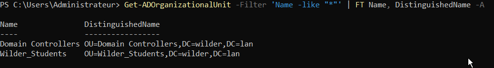
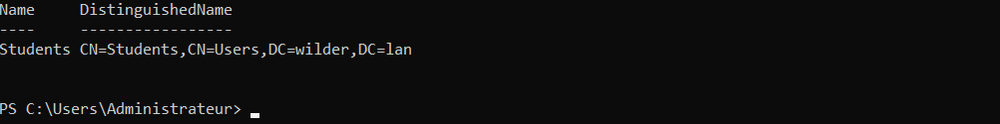
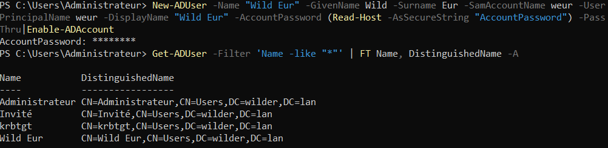
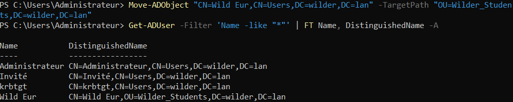
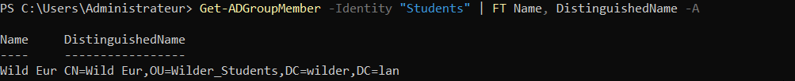

# Créer et Gérer des Unités Organisationnelle Active Directory sur Windows Core

## Création d'une Unité Organisationnelle
Pour créer une Unité Organisationnelle nommée __Wilder_Students__, entrer la commande :

```powershell
New-ADOrganizationalUnit -Name "Wilder_Students"
```

Pour afficher les Unité Organisationnelles, on utilise la commande :

```powershell
Get-ADOrganizationalUnit -Filter 'Name -like "*"' | FT Name, DistinguishedName -AGet
```



### Supprimer une Unité Organisationnelle
Pour supprimer une unité Organisationnelle __Wilder_Students__, nous procédons en deux étapes :

1. Retirer la protection sur la suppressions accidentelles de l'Unité Organisationnelle __Wilder_Students__ contenue dans le Contrôleur de Domaine __wilder.lan__:

```powershell
Set-ADOrganizationalUnit -Identity "OU=Wilder_Students,DC=wilder,DC=lan" -ProtectedFromAccidentalDeletion $false
```

2. Suppression de l'Unité Organisationnelle :
```powershell
Remove-ADOrganizationalUnit -Identity "OU=Wilder_Students,DC=wilder,dc=lan"
```

Si l'Unité Organisationnelle contient elle même d'autre Unités Organisationnelles, on peut utiliser l'option __-Recursive__

```powershell
Rmove-ADOrganizationalUnit -Identity "OU=Wilder_Students,DC=domtest,dc=lan" -Recursive
```

Un message de confirmation s'affiche pour confirmer la suppressions de l'OU.


## Création d'un Groupe d'utilisateur
Pour créer un groupe d'utilisateur nommé __Students__, entrer la commande :

```powershell
New-ADGroup -name "Service Comptable" -GroupCategory Security -GroupScope Global -DisplayName "Service Comptable" -Path "CN=Users,DC=wilder -,DC=lan" -Description "Groupe des comptables de l'entreprise"
```

Pour lister les groupe, ou, dans notre cas liste le groupe que l'on vient de créer, utiliser la commande :

```powershell
Get-ADGroup -Filter 'Name -like "Students"' | FT Name, DistinguishedName -A
```



### Supprimer un groupe

Pour Supprimer le groupe nommé __Students__, entrer la commande :

```powershell
Remove-ADGroup Students
```
En l'absence du nom de groupe précisé, l'invite de commande nous demande le nom du groupe à suprimer.

Un message de confirmation s'affiche pour confirmer la supression du groupe.


## Création d'un Utilisateur
Pour créer un utilisateur nommé __Wild Eur__, entrer la commande :

```powershell
New-ADUser -Name "Wild EUR" -GivenName Wild -SurName Eur -SamAccountName weur -UserPrincipalName weur -DisplayName 'Wild Eur' -AccountPassword (Read-Host -AsSecureString "AccountPassword") -PassThru|Enable-ADAccount
```
- Le mot de passe pour l'utilisateur sera à saisir dans l'invite de commande à la création de l'utilisateur.
- La commande __Enable-ADAccount__ active le compte de l'utilisateur

Pour afficher l'utilisateur nouvellement crée et les rôles dont il dispose :
```powershell
Get-ADUser -Filter 'Name -like ""' | FT Name, DistinguishedName -A
```



### Supprimer un utilisateur
Pour supprimer un utilisateur, entrer la commande :

```powershell
Remove-ADGroupMember -Identity "Wild Eur" -Members "CN=Wild Eur,OU=Wilder_Students,DC=wilder,DC=lan"
```

### Placer un utilisateur dans une Unitée Organisationnelle

```powershell
Move-ADObject "CN=Wild Eur,CN=Users,DC=wilder,DC=lan" -TargetPath "OU=Wilder_Students,DC=wilder,DC=lan"
```



### Placer un utilisateur dans un groupe

```powershell
Add-ADGroupMember -Identity "Students" -Members "CN=Wild Eur,OU=Wilder_Students,DC=wilder,DC=lan"
```

Pour lister les utilisateurs d'un groupe, entrer la commande :

```powershell
Get-ADGroupMember -Identity "Students" | FT Name, DistinguishedName -A
```

