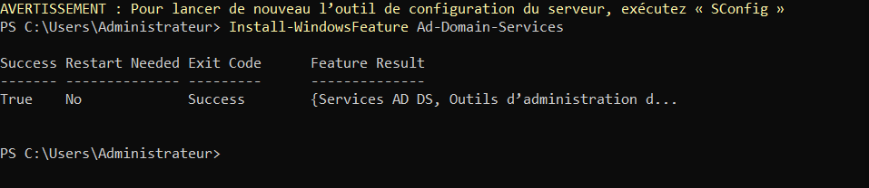
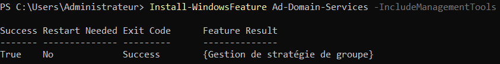
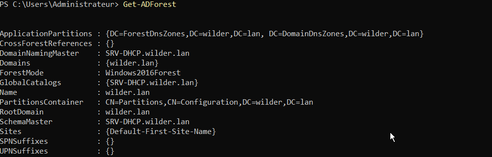
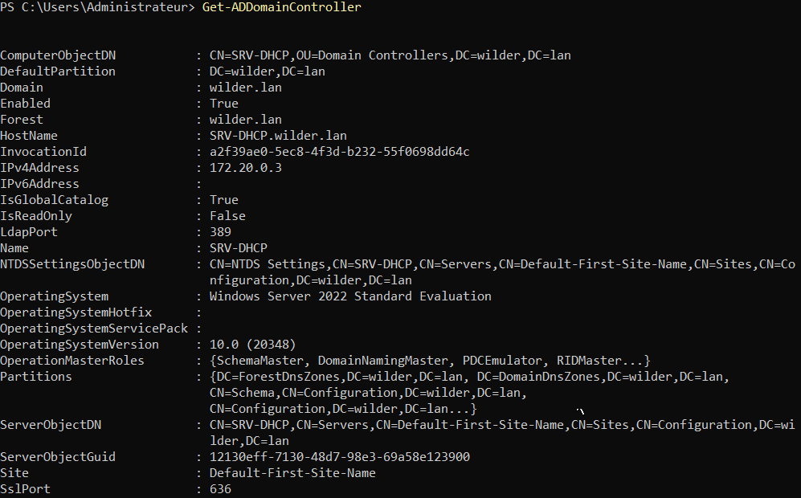
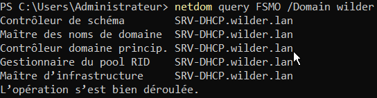

# Installation d'un Active Directory Sur un serveur Windows Core 2022

## Installation de Microsoft Active Directory
1. Installer le service Active directory avec la commande :
```powershell
Install-WindowsFeature Ad-Domain-Services
```


2. Installer les modules de gestion pour le service Active Directory
commande :
```powershell
Install-WindowsFeature -name AD-Domain-Services -IncludeManagementTools
```


## Installation d'une nouvelle forêt et d'un nouveau Domaine Active Directory
Pour installer une nouvelle forêt et notre nouveau domaine Active Directoy avec pour nom de domaine __wilder.lan__ et nom netbios __WILDER__, entrer la commande :
commande :
```powershell
Install-ADDSForest -CreateDnsDelegation:$false -DatabasePath "C:\Windows\NTDS" -DomainMode 7 -DomainName "wilder.lan" -DomainNetbiosName "WILDER" -ForestMode 7 -InstallDNS:$true -LogPath "C:\Windows\NTDS" -NoRebootOnCompletion:$false -SysvolPath "C:\Windows\SYSVOL"
```



### Décomposition de la commande Install-ADDSForest
- __-CreateDnsDelegation:$false:__ Indique de ne pas crée de délégation pour la zone partente de notre domaine (.lan étant la zone parente de notre domaine wilder.lan)
- Les mode de niveau __7__ indiques le niveau fonctionnel du domaine et de la forêt (niveau fonctionnel pour windows serveur 2016)
- __DatabasePath "C:\Windows\NTDS"__ est l'enmplacement du dossier NTDS, dossier de la base de donnée NTDS contenant les donnée de notre AD
- __-InstallDNS:$true:__ permet d'installer le service DNS necessaire à l'AD
- __-LogPath  C:\Windows\NTDS__: Dossier contenant les logs AD
- __-SysvolPath C:\Windows\SYSVOL__ : Est l'emplacement du dossier SYSVOL contenant les données à répliquer entre les serveurs AD (Script, GPO, définitions de zones etc…)

Une fois la commande entrée, le serveur nous demande de créer un mot de passe administrateur pour l'Active Directory

Le mot de passe nouvellement crée, une confirmation nous est demandé et le serveur redémarrre à la fin de l'installation car nous avons séléctionnée l'option : __-NoRebootOnCompletion:$false__

## Vérification de l'installation
Au redémarrage, le serveur nous demande de nous authentifier avec notre nouveau mot de passe

On peut vérifier que notre installation est complète en affichant les informations relatives au rôle Contrôleur de Domaine :

```powershell
Get-ADDomaineController
```


Pour afficher les rôles __FMO__ que le serveur peut avoir :

```powershell
netdom query FSMO /Domain domtest
```



On peut enfin afficher les informations relative à la forêt :
```powershell
get-AdForest
```


