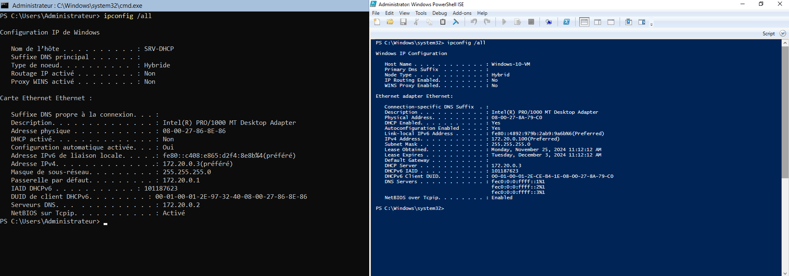

# Installer et configurer un serveur DHCP sur Windows serveur 2022 CLI avec PowerShell

## Installation du serveur DHCP

### Configurez un adresse IP statique au serveur DHCP :

Au lancement de votre __Windows Serveur 2022 en CLI__  ouvrez une fenêtre de configuration de PowerShell en Administrateur.

Affectez une adresse Ip statique au serveur DHCP avec la commande suivante :\
(Vous pouvez remplacer les adresses IP de cette comande en fonction de la necessitée de votre réseau. Dans les exemple qui suivrons nous attribuerons des adresses IP correspondantes au réseau : __172.20.0.0/24__)

```PowerShell
New-NetIPAddress -IPAddress 172.20.0.0.3 -InterfaceAlias "Ethernet" -DefaultGateway 172.20.0.1 -AddressFamily IPv4 -PrefixLength 24
```

Configurez les propriétés TCP/IP du serveur DHCP avec l'adresse IP du serveur DNS :
```PowerShell
Set-DnsClientServerAddress -InterfaceAlias "Ethernet" -ServerAddresses 172.20.0.2
```

### Renommez le serveur DHCP

Pour renommer l'ordinateur de notre serveur DHCP saisissez la commande :\
`Rename-Computer -Name DHCP1`

Puis redémarrez le serveur pour que le nom prenne effet\
`Restart-Computer`

### Installer le service DHCP Windows

Une fois le serveur redémarré, dans une fenêtre PowerShell, installez le service DHCP avec la commande :
```PowerShell
Install-WindowsFeature DHCP -IncludeManagementTools
```

Le service DHCP est installé sur le serveur.

## Configuration du serveur DHCP

L'installation du DHCP términée, nous pouvons configurer l'étendue de la plage d'attribution d'adresse IPV4. Vous pouvez remplacer le nom de votre plage par le nom que vous souhaitez et saisir le début et la fin de votre plage correspondant à votre réseau.\ 
Nous nommerons notre plage _"Corpnet"_ et notre plage sera comprise dans l'étendue de notre réseau configuré précédemment.

```PowerShell
Add-DhcpServerv4Scope -name "Corpnet" -StartRange 172.20.0.100 -EndRange 172.20.0.200 -SubnetMask 255.255.255.0 -State Active
```

Notre serveur DHCP est maintenant configuré pour accueillir des nouveaux poste client et leur attribuer une adresse IPV4 dynamique.

Avec la commande `ipconfig  /all` sur nos postes client et serveur, nous pouvons voir que l'adresse ip attribuée à un poste client (droite), connectée sur le réseau, correspond à une adress ip située dans l'étendue configurée précédemment



Sur le poste serveur (gauche), nous pouvons également voir que le nom du serveur DHCP correspond bien à celui que nous avons paramétré :__SRV-DHCP__.

Nous profitons de cette étape pour noter l'adresse MAC physique de l'adaptateur ethernet de notre poste client (écran de droite)  afin de lui réserver une adresse ip statique.

### Configurer un adress ip statique pour un poste client

Dans la consle PowerShell du serveur, pour attribuer l'adresse IP fixe __172.20.0.10__ à notre poste client Windows, entrez la commande suivante, en prenant soin de remplacer l'adresse MAC de `-ClientID` et la description du paramètre `-Description` par les identifiants correspondant à votre poste client :
```PowerShell
Add-DhcpServerv4Reservation -ScopeId 172.20.0.0 -IPAddress 172.20.0.10 -ClientId "08-00-27-8A-79-C0" -Description "Ordinateur-Client"
```

Depuis notre poste client, nous pouvons désormais entrer la commande `ipconfig /renew` afin de demander au serveur DHCP l'attribution de notre nouvelle adresse statique. Un message d'avertissement apparaît, nous indiquant que l'adresse MAC de notre poste client est déjà reservé sur le réseaux.\
Saisissez une nouvelle fois la commande `ipconfig \renew` ou `ipconfig \all` pour afficher l'adresse ip statique de notre poste client.


Ces commandes nous indique que l'adresse ip statique de notre poste client est bien celle que nous avons configuré précédemment.
