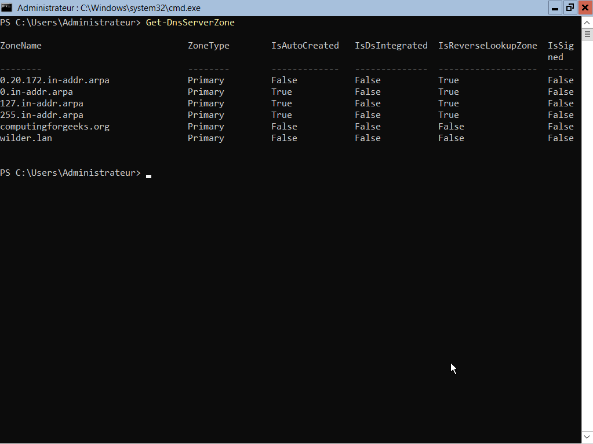
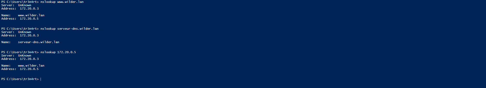

# Installation d'un serveur DNS sur Windows Server Core avec PowerShell

## Installation du Service DNS
Pour installer un serveur DNS sur un serveur windows Core, ouvrir une console PowerShell et executer la commande :

```powershell
Install-WindowsFeature -Name DNS -IncludeManagementTools
```

On peut vérifier si le service DNS est installé sur le serveur avec la commande : 

```powershell
Get-WindowsFeature –Name DNS
```

## Configurer le sereur DNS

### Créer une zone de transfert DNS

Pour créer une zone de transfert DNS, on utilise la commande :

```powershell
Add-DnsServerPrimaryZone -Name "wilder.lan" -ZoneFile "wilder.lan.dns" -DynamicUpdate None -PassThru 
```

### Créer une zone de recherche inversée

On ajoute un zone de recherche inversée avec la commande :

```powershell
Add-DnsServerPrimaryZone -NetworkID 172.20.0.0/24 -ZoneFile "0.20.172.in-addr.arpa.dns" -DynamicUpdate None -PassThru 
```

On peut vérifier que les zones on bien été crées avec la commande :

```powershell
Get-DnsServerZone
```


### Créer un fichier de rechecherche de Zone sur le serveur DNS

Les types d'enregistrement des Zones que l'on peut paramètrer sont les suivants :
 
- A – A record
- SOA – Start of Authority
- MX – Mail for Exchange
- NS – Name Server
- CN ou CNAME – Canonical Name
- SRV – Services Record
- PTR – Pointer

Nous allons créer un enregistrement pour la zone A, et un enregistrement de nom Canonique de type CN pour avoir deux résolutions de nom possible.

1. Enregistrement de zone A :
Entrer la commande :
```powershell
Add-DnsServerResourceRecordA -Name "www" -ZoneName "wilder.lan" -IPv4Address "172.20.0.5" -TimeToLive 01:00:00 -CreatePtr -PassThru 
```

2. Nom Canonique :
Entrer la commande :
```powershell
Add-DnsServerResourceRecordCname -Name "dns" -HostnameAlias "dns.wilder.lan" -ZoneName "wilder.lan"
```

Pour verifier les enregistrements effectués sur le serveur :
```powershell
Get-DnsServerResourceRecord -ZoneName "wilder.lan" | Format-Table -AutoSize -Wrap
```


## Test 

### Test local
On peut vérifier la résolution de nos adresses DNS sur notre seruveur en local grâce à la commande __nslookup__

```powershell
nsloockup www.wilder.lan
```

et notre alias :

```powershell
nsloockup serveur-dns.wilder.lan
```

### Test Distant
Pour vérifier nos résolution d'adresse depuis un poste client connecté sur le réseau, on peut utiliser les même commande dans une console powershell :

Pour notre adresse complète :
```powershell
nslookup www.wilder.com
```

Pour notre alias :
```powershell
nslookup serveur-dns.wilder.com
```

Pour une résolution inverse afin de trouver le nom correspondant à l'adresse IP :
```powershell
nslookup 172.20.0.5
```



# Supprimer une Zone primaire ou une ressource

## Supprimer une Zone primaire avec PowerShell

Pour supprimer une Zone entière, entrer la commande :
```powershell
Remove-DnsServerZone "wilder.lan" -PassThru
```

## Supprimer une ressource d'une Zone avec PowerShell
Pour supprimer une ressource particulière, entrer la commande :
Pour supprimer une Zone entière, entrer la commande :

```powershell
Remove-DnsServerResourceRecord -ZoneName "contoso.com" -RRType "A" -Name "Host01" -RecordData "10.17.1.41"
```

Les paramètres de ces commandes peuvent être affinées afin de supprimer plusieurs ressources en fonction de leur nom ou de leur type. Voir la [documentation Microsoft](https://learn.microsoft.com/en-us/powershell/module/dnsserver/remove-dnsserverresourcerecord?view=windowsserver2025-ps) à ce sujet pour plus de détails.
